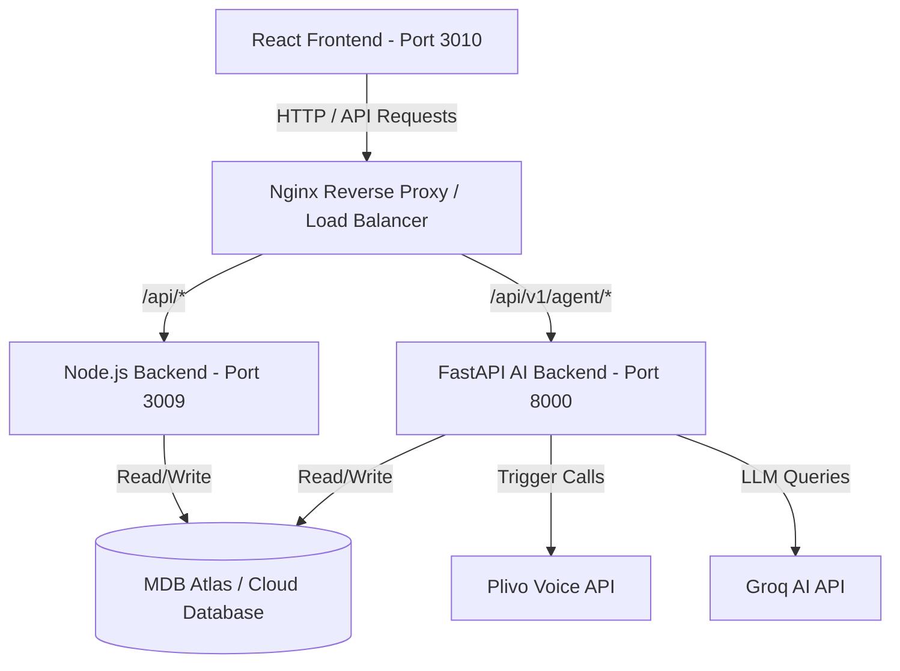

# AWS Deployment Guide - SSES Admission Portal (with AI Voice Agent)

This document provides complete instructions for the DevOps/Infrastructure engineer to build, run, and deploy the new AI Calling/Voice Agent Python service (`calling_backend`) alongside the existing Node.js Backend (`server`) and React Frontend (`client`) using **Docker Compose** and **Nginx**.

---

## 1. System Architecture Overview

The system now consists of three main containerized services running under Docker Compose:



---

## 2. Docker Setup & Changes Made

We have prepared all infrastructure definitions for deployment:

1. **`calling_backend/Dockerfile` [NEW]**: Added a lightweight, optimized multi-stage build image using `python:3.11-slim` that installs dependencies and runs the FastAPI app on port `8000` using `uvicorn`.
2. **`docker-compose.yml` [UPDATED]**: Added the new `calling-backend` service block, mapped to build `./calling_backend` with port `8000:8000` and loaded environment variables from `./calling_backend/.env`.

---

## 3. Environment Variables Configuration

Make sure the following `.env` configurations are injected during deployment:

### Node.js Backend (`server/.env`)
*(No new variables needed, keep existing settings)*

### React Frontend (`client/.env` / Build Arguments)
Set the public URL of the AI Agent API during client build:
```env
VITE_AGENT_API_URL=https://mkt.central.ssism.org/api/v1
VITE_AGENT_API_KEY=ae7e9b3c18c819532a773c9a6f1e633fc8fd2d29e802cda2ffc1cb8d7b597bfb
```

### Python Calling Backend (`calling_backend/.env`)
Provide these variables in the host environment or the container `.env` file:
```env
MONGODB_URL=your_mongodb_atlas_connection_string
MONGODB_DB_NAME=SSES-Admission-Portal

# Plivo Credentials
PLIVO_AUTH_ID=your_plivo_auth_id
PLIVO_AUTH_TOKEN=your_plivo_auth_token
PLIVO_FLOW_ID=your_plivo_flow_id
PLIVO_FROM_NUMBER=your_plivo_from_number
PLIVO_WHATSAPP_SRC=your_plivo_whatsapp_src

# Domain / CORS Rules (Add production domains)
BACKEND_URL=https://mkt.central.ssism.org
VALIDATE_PLIVO_SIGNATURE=false
ALLOWED_ORIGINS=http://localhost:5173,https://mkt.central.ssism.org

# internal matching key with React client
INTERNAL_API_KEY=ae7e9b3c18c819532a773c9a6f1e633fc8fd2d29e802cda2ffc1cb8d7b597bfb

# LLM support settings
GROQ_API_KEY=your_groq_api_key
GROQ_MODEL=llama-3.3-70b-versatile
GROQ_BASE_URL=https://api.groq.com/openai/v1
```

---

## 4. Nginx Reverse Proxy Config

To route `/api/v1/agent` API and webhooks to the Python container correctly under the main domain, update the **Nginx configuration** on your EC2/Load Balancer instance:

```nginx
server {
    listen 80;
    listen 443 ssl;
    server_name mkt.central.ssism.org; # Replace with actual domain

    # 1. Frontend SPA
    location / {
        proxy_pass http://127.0.0.1:3010; # Map to React Client Container
        proxy_http_version 1.1;
        proxy_set_header Upgrade $http_upgrade;
        proxy_set_header Connection 'upgrade';
        proxy_set_header Host $host;
        proxy_cache_bypass $http_upgrade;
    }

    # 2. Python AI Calling Backend
    location /api/v1/agent/ {
        proxy_pass http://127.0.0.1:8000/agent/; # Route directly to FastAPI container port 8000
        proxy_http_version 1.1;
        proxy_set_header Upgrade $http_upgrade;
        proxy_set_header Connection 'upgrade';
        proxy_set_header Host $host;
        proxy_set_header X-Real-IP $remote_addr;
        proxy_set_header X-Forwarded-For $proxy_add_x_forwarded_for;
        proxy_set_header X-Forwarded-Proto $scheme;
    }

    # 3. Node.js Express Backend
    location /api/ {
        proxy_pass http://127.0.0.1:3009/api/; # Route to Node.js Backend Container port 3009
        proxy_http_version 1.1;
        proxy_set_header Upgrade $http_upgrade;
        proxy_set_header Connection 'upgrade';
        proxy_set_header Host $host;
        proxy_set_header X-Real-IP $remote_addr;
        proxy_set_header X-Forwarded-For $proxy_add_x_forwarded_for;
        proxy_set_header X-Forwarded-Proto $scheme;
    }
}
```

---

## 5. Build and Deploy Steps

Once configs are in place, the DevOps engineer can deploy the updated portal with a single command:

```bash
# 1. Navigate to the root directory
cd /path/to/SSES-Admission-Portal

# 2. Pull latest code changes
git pull origin main

# 3. Build and recreate all services (downtime-free with docker compose rebuild)
docker compose up -d --build
```

### Verification Command:
```bash
# Verify all three containers are healthy and running
docker compose ps
```
